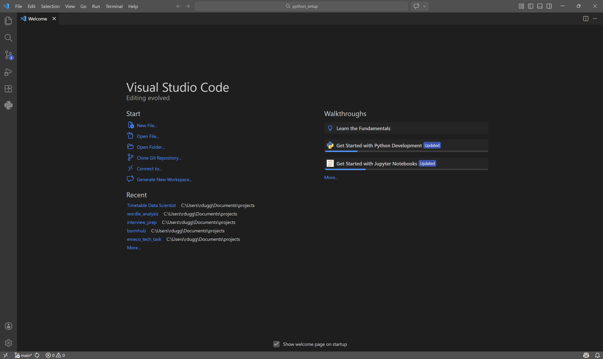
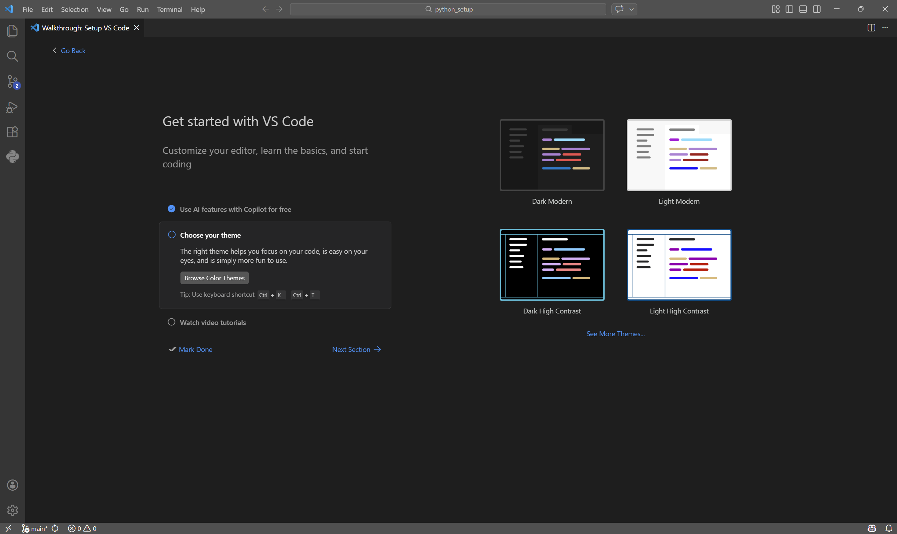
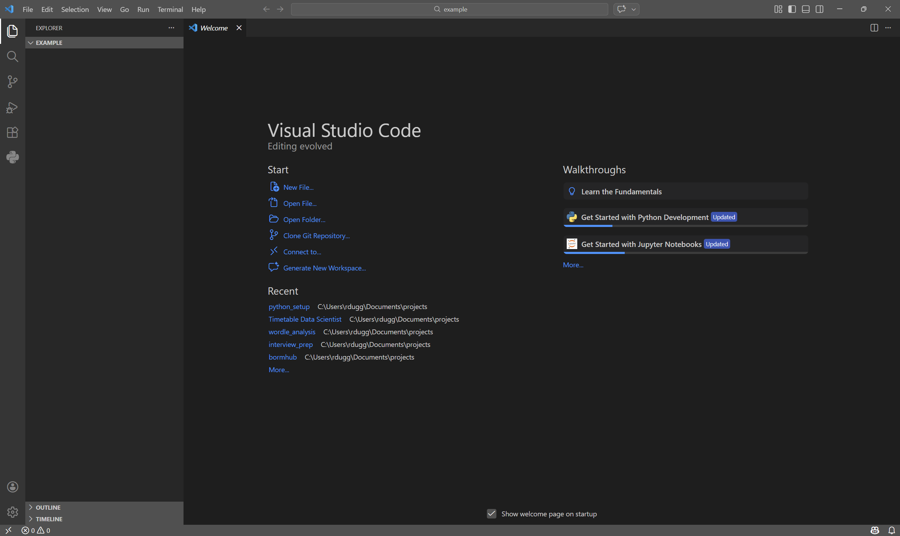

# Initial Setup

## Visual Studio Code

For this project I will be referencing how to edit and run code with Visual Studio Code.

Visual Studio Code or VSCode as it is often known, is at its core a text editor. All code is just text that your computer will interpurate run when requested, so a good system for editing text is a must. VSCode is configurable to help you write code of all different varieties. So we will need to configure it to run Python.

Please download and install from [Visual Stuido Code Download](https://code.visualstudio.com/) or copy the link here https://code.visualstudio.com/

Once you have installed it an opened it up you will be met with its new user welcome screen.



In the walkthroughs section, 



### Extensions

On the left hand of the VSCode window you should see a series of icons. A piece of paper, a spy glass, dots with lines connecting them, a play symbol with a bug on it and finally a number of boxes with the top right one being rotated. Please click on the last one, this is the extensions tab of VSCode. From here you can install useful extensions that allow easier writing of code. In our case we are going to search in the bar that appears when you click this for Python. This will bring up a window within VSCode that you can see in the following screenshot, click install on the Python Extension.


## Other installations

Some of the installations don't have such a simple online process to install and require you to install them from the command line. This can be a bit scary at first but hopefully these instructions will be clear and to the point so you don't get too overwhelmed.

## UV

UV is a useful tool that will help configure our python enviroment (where the python code will run). It also helps install and handle python libraries we are able to use. If that means nothing to you so far, that's quite alright but follow the instructions below to get it setup for the moment.

Open a window of PowerShell if you are on Windows and run the following command

```PowerShell
powershell -ExecutionPolicy ByPass -c "irm https://astral.sh/uv/install.ps1 | iex"
```

You should get an output similar to the following lines

```PowerShell
Installing to C:\Users\rdugg\.local\bin
  uv.exe
  uvx.exe
  uvw.exe
everything's installed!
```

To check that the install completed successfully run the following command

```PowerShell
uv --help
```

Which should give a result like the following.

```PowerShell
An extremely fast Python package manager.

Usage: uv.exe [OPTIONS] <COMMAND>

Commands:
  auth     Manage authentication
  run      Run a command or script
  init     Create a new project
  add      Add dependencies to the project
  remove   Remove dependencies from the project
  version  Read or update the project's version
  sync     Update the project's environment
  lock     Update the project's lockfile
  export   Export the project's lockfile to an alternate format
  tree     Display the project's dependency tree
  format   Format Python code in the project
  tool     Run and install commands provided by Python packages
  python   Manage Python versions and installations
  pip      Manage Python packages with a pip-compatible interface
  venv     Create a virtual environment
  build    Build Python packages into source distributions and wheels
  publish  Upload distributions to an index
  cache    Manage uv's cache
  self     Manage the uv executable
  help     Display documentation for a command

Cache options:
  -n, --no-cache               Avoid reading from or writing to the cache, instead using a temporary directory for the
                               duration of the operation [env: UV_NO_CACHE=]
      --cache-dir <CACHE_DIR>  Path to the cache directory [env: UV_CACHE_DIR=]

Python options:
      --managed-python       Require use of uv-managed Python versions [env: UV_MANAGED_PYTHON=]
      --no-managed-python    Disable use of uv-managed Python versions [env: UV_NO_MANAGED_PYTHON=]
      --no-python-downloads  Disable automatic downloads of Python. [env: "UV_PYTHON_DOWNLOADS=never"]

Global options:
  -q, --quiet...
          Use quiet output
  -v, --verbose...
          Use verbose output
      --color <COLOR_CHOICE>
          Control the use of color in output [possible values: auto, always, never]
      --native-tls
          Whether to load TLS certificates from the platform's native store [env: UV_NATIVE_TLS=]
      --offline
          Disable network access [env: UV_OFFLINE=]
      --allow-insecure-host <ALLOW_INSECURE_HOST>
          Allow insecure connections to a host [env: UV_INSECURE_HOST=]
      --no-progress
          Hide all progress outputs [env: UV_NO_PROGRESS=]
      --directory <DIRECTORY>
          Change to the given directory prior to running the command [env: UV_WORKING_DIR=]
      --project <PROJECT>
          Discover a project in the given directory [env: UV_PROJECT=]
      --config-file <CONFIG_FILE>
          The path to a `uv.toml` file to use for configuration [env: UV_CONFIG_FILE=]
      --no-config
          Avoid discovering configuration files (`pyproject.toml`, `uv.toml`) [env: UV_NO_CONFIG=]
  -h, --help
          Display the concise help for this command
  -V, --version
          Display the uv version

Use `uv help` for more details.
```

This means everything is installed and ready to go. Please now close that window of PowerShell.

If you are struggling with this process below are some useful UV related links
- 
- 


# Bringing it all together

Now you have all the systems installed we are ready to make them work together.

The first step of this process is close down any windows of VSCode or any open Terminals. Some of the install processes wont take effect until windows are relauched so please make sure they are closed before starting the next steps

Now reopen VSCode

We are now going to select a place for our code to be saved. In the top bar of the VSCode you should see the following options, File, Edit, Selection, View, Go, Run, Terminal and Help.

Please click on File and in the dropdown menu "Open Folder...". In this window please select a folder in which you want to save your files. I would suggest a empty folder to start with so we can start to fill it out as we go.

Doing so should give you a VSCode screen which looks similar to the following screenshot



